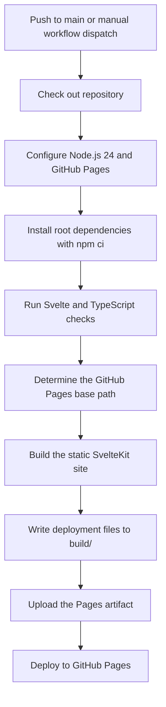

# Castillo Real Estate Group Holdings

This repository contains the public website for Castillo Real Estate Group Holdings LLC. It is a componentized, entirely static SvelteKit application based on the preserved original HTML design.

The main page includes the hero, company overview, investment properties, proposals, team, and contact sections. Existing content, responsive behavior, image assets, portfolio filtering, lightbox behavior, carousel behavior, and visual identity are implemented with Svelte components rather than the original template JavaScript.

## Technology

- SvelteKit 2 and Svelte 5 with TypeScript and runes syntax
- Vite 8 for local development and production builds
- Tailwind CSS 4 for styling
- `@sveltejs/adapter-static` for static output
- npm with a root-level `package.json`, lockfile, and `node_modules`
- GitHub Actions and GitHub Pages for deployment

The production site has no server runtime, database, or runtime content service.

## Project structure

```text
.
├── src/
│   ├── lib/
│   │   ├── components/       Reusable layout and page components
│   │   ├── data/             Typed local site content
│   │   └── icons/            Individual Svelte icon components
│   ├── routes/               SvelteKit routes and error handling
│   ├── app.css               Tailwind imports, global styles, and design tokens
│   ├── app.d.ts
│   └── app.html
├── static/                   Assets copied into the static build
├── _legacy-starters/         Preserved reference HTML, CSS, JavaScript, and assets
├── .github/workflows/        GitHub Pages deployment workflow
├── package.json
├── svelte.config.js
└── vite.config.ts
```

Files under `_legacy-starters/` are reference-only and are not used by the runtime application. Reused assets belong under `static/`.

## Requirements

- Node.js 24
- npm

The included development container provides Node.js, npm, Svelte tooling, and port forwarding for the application.

## Development container

The repository includes a development container configuration under `.devcontainer/`. It provides a consistent Node.js environment with the Svelte CLI, TypeScript tooling, GitHub CLI, Claude Code, Codex, and the recommended VS Code extensions for Svelte, Tailwind CSS, ESLint, and Prettier.

To use it with Visual Studio Code:

1. Install Docker and the VS Code Dev Containers extension.
2. Open this repository in VS Code.
3. Run **Dev Containers: Reopen in Container** from the command palette.
4. Wait for the container setup command to finish.
5. Open a terminal at `/workspace` and run `npm ci`.
6. Run `npm run dev` and open the forwarded port `2275`.

The repository is mounted at `/workspace`. The root-level `package.json`, `package-lock.json`, and `node_modules/` belong to the application; do not install dependencies beneath `src/` or create a nested package. Named container volumes persist the npm cache, global Node tooling, CLI state, and application dependencies between container rebuilds.

Port `2275` is published by the container and forwarded by VS Code as the SvelteKit development server. No Docker Compose services or backend containers are required because the production application is entirely static.

## Install dependencies

Install dependencies from the repository root so they are written to the top-level `node_modules/` directory:

```sh
npm ci
```

Use `npm install` only when intentionally changing dependencies and updating `package-lock.json`.

## Local development

Start the SvelteKit development server from the repository root:

```sh
npm run dev
```

The canonical development port is `2275`. Vite binds to `0.0.0.0`, and the devcontainer publishes and forwards the same port.

Open the application at:

```text
http://localhost:2275/
```

## Available commands

| Command                                         | Purpose                                                          |
| ----------------------------------------------- | ---------------------------------------------------------------- |
| `npm run dev`                                   | Start the development server on port 2275.                       |
| `npm run check`                                 | Synchronize SvelteKit and run Svelte and TypeScript diagnostics. |
| `npm run check:watch`                           | Run Svelte diagnostics continuously.                             |
| `npm run lint`                                  | Check formatting and run ESLint.                                 |
| `npm run format`                                | Format supported project files with Prettier.                    |
| `npm run build`                                 | Generate the static production site in `build/`.                 |
| `npm run preview -- --host 0.0.0.0 --port 2275` | Preview the production build on the canonical port.              |

## Verification and production build

Run the standard verification sequence before deployment:

```sh
npm run check
npm run lint
npm run build
```

The production artifact is written to `build/`. It contains the prerendered site, copied static assets, and `404.html` for invalid routes. The generated directory is the deployment artifact and should not be edited directly.

## Base paths

Local development uses the domain root. Production builds may set `BASE_PATH` when the site is hosted beneath a GitHub Pages project path:

```sh
BASE_PATH=/repository-name npm run build
```

Do not hard-code the repository name in components. SvelteKit path helpers resolve internal navigation and asset URLs for both root hosting and project Pages hosting.

## GitHub Pages deployment

The workflow at `.github/workflows/static.yml` deploys the site when changes are pushed to `main` or when the workflow is started manually. It performs the following steps:

1. Checks out the repository.
2. Configures Node.js 24 and GitHub Pages.
3. Installs root dependencies with `npm ci`.
4. Runs `npm run check`.
5. Determines the appropriate GitHub Pages base path.
6. Builds the static site.
7. Uploads only the `build/` directory.
8. Deploys the uploaded artifact with the official GitHub Pages action.

Repository Pages must be configured to use GitHub Actions as its deployment source.

Diagrammatically:



## Application organization

Route composition belongs in `src/routes/`. Reusable page sections and UI elements belong in `src/lib/components/`, individual icons belong in `src/lib/icons/`, and typed content belongs in `src/lib/data/`.

Global design tokens and cross-component styles live in `src/app.css`. Component-specific behavior should remain with the component that owns the corresponding markup.

The root error route uses the reusable `FallbackPage` component so invalid URLs retain the site navigation, branded styling, and footer.
